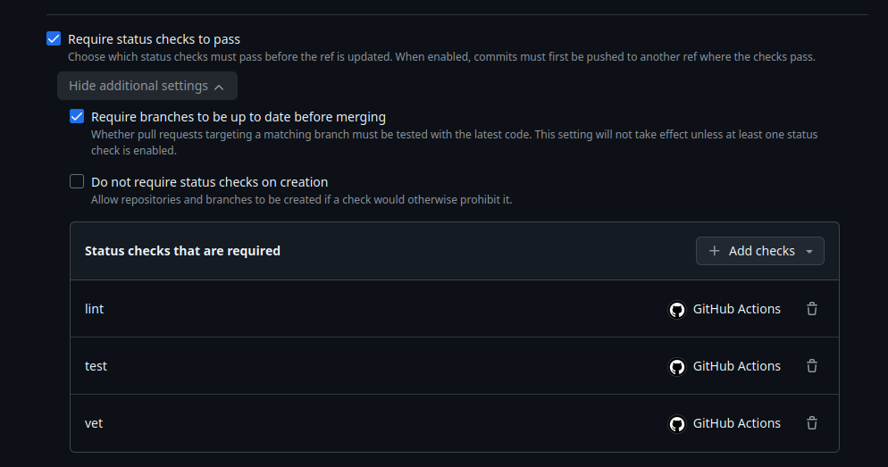
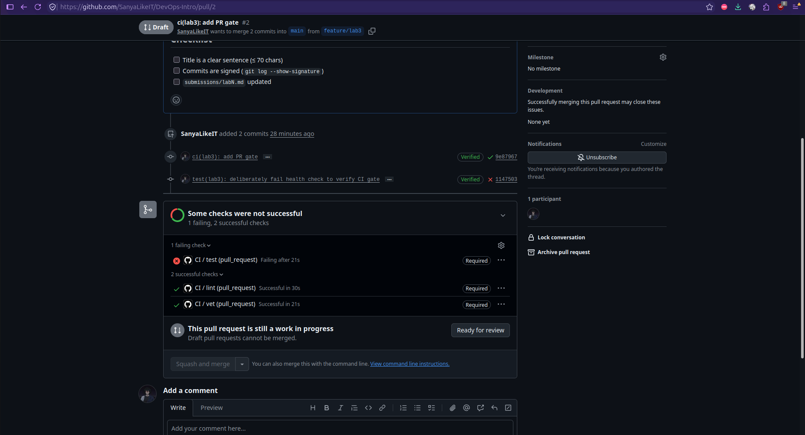
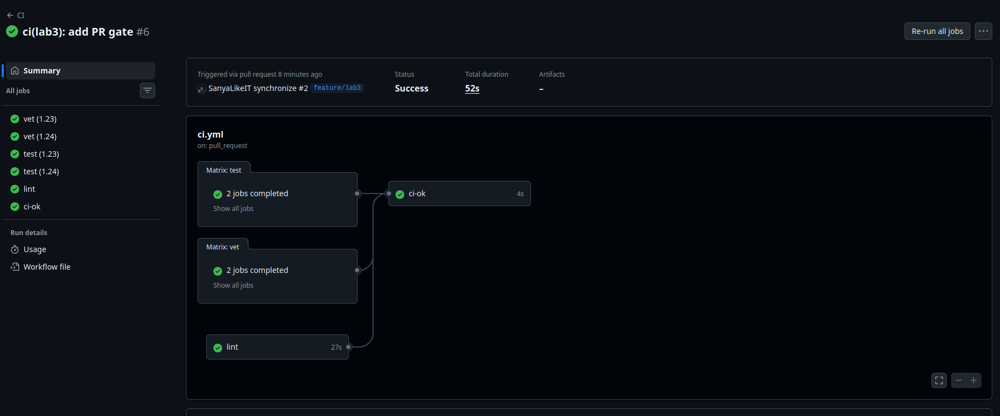
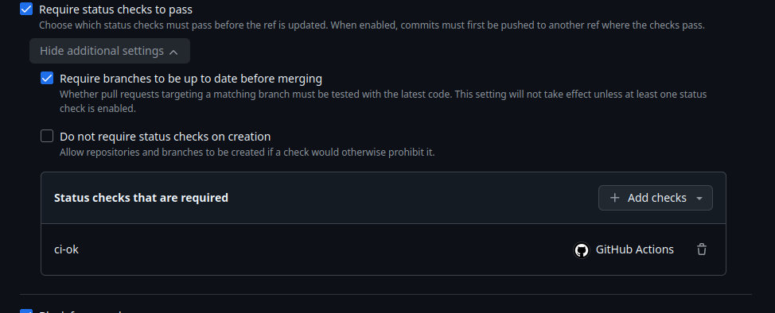
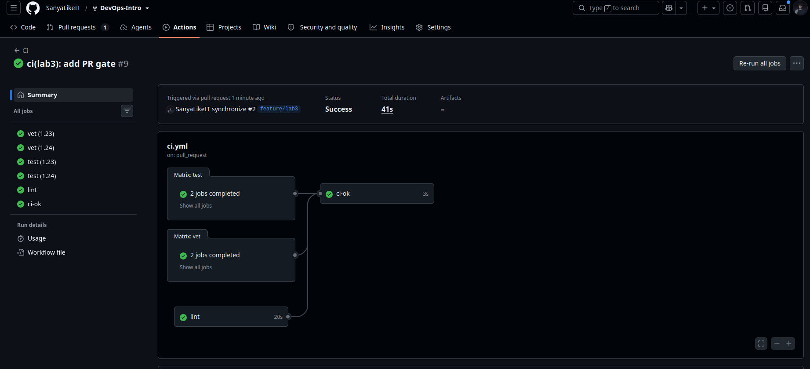

# Lab 3: A PR-gated pipeline for QuickNotes

## Chosen path and current status

This submission uses GitHub Actions because the repository and pull requests are
hosted on GitHub, so the checks and branch rules are available in the same place.
The baseline pipeline, deliberate failure, recovery on GitHub, required
status checks, Go-version matrix, aggregate gate, cache measurements, and all
three bonus optimizations have been verified. Docs-only path filtering is
implemented; one separate docs-only PR on the fork is still required to record
that the workflow is not triggered when the filtered workflow is already on
`main`.

- [Course draft PR](https://github.com/inno-devops-labs/DevOps-Intro/pull/1603)
- [Fork validation PR](https://github.com/SanyaLikeIT/DevOps-Intro/pull/2)

## Task 1: Baseline gate and evidence

The baseline workflow ran three independent jobs on `ubuntu-24.04` with Go `1.24`:
`go vet ./...`, `go test -race -count=1 ./...`, and golangci-lint `v2.5.0`.
All checks run against `app/`. Actions are pinned to full commit SHAs, and
`GITHUB_TOKEN` has only `contents: read` permission. Both setup-go caching and
the lint action's cache were disabled for the baseline; setup-go caching is now
enabled for the next measurement.

| Evidence | Result |
|---|---|
| [Initial run 35305034562](https://github.com/SanyaLikeIT/DevOps-Intro/actions/runs/35305034562) | `vet`, `test`, and `lint` succeeded at commit `9e87967794177539666b6d51de5cbd38f8137f6d`. |
| Deliberate failure commit | `11475036c6b3aa2145a16a66bca12fff83881944` changed the expected health note count from one to two. |
| [Failed run 35305763786](https://github.com/SanyaLikeIT/DevOps-Intro/actions/runs/35305763786) | `test` failed; `vet` and `lint` succeeded. |
| Recovery commit | `e8f856422d2a6912414234ef42c03a7c624c8a2e` restores the original assertion. |
| Recovery validation | Local `go vet ./...` and `go test -race -count=1 ./...` passed using Go 1.24.13. [Recovery run 35306448411](https://github.com/SanyaLikeIT/DevOps-Intro/actions/runs/35306448411) passed all three jobs at commit `43ac23b6129c065beb2e65f7bcff2980f6f78f60`. |

At the baseline stage, the fork ruleset required `vet`, `test`, and `lint` and
required the branch to be up to date. Those baseline settings were confirmed
through the public branch-rules API on September 18, 2026; the relevant response
is saved in [required-checks.json](evidence/lab3/required-checks.json). After the
Go-version matrix was added, the rule was updated to require only the aggregate
`ci-ok` check while keeping the strict up-to-date requirement.

The second screenshot shows the failed required test and two successful required
checks. It also shows a Draft PR, which independently prevents merging; the
disabled merge button alone is therefore not proof that CI caused the block.
The active required-check rule and failed check establish that normal merging
requires the test to pass. No merge or bypass was attempted.

### Task 1 design questions

**a) Why pin the runner?** `ubuntu-24.04` avoids an automatic migration to a
different Ubuntu release when `ubuntu-latest` changes. Such a migration can
change compilers, system libraries, package availability, and command behavior.
The numbered runner image still receives updates, so this is an OS-release pin,
not a fully immutable environment.

**b) Why separate the jobs?** Independent jobs can run concurrently and report
separate results. A failed test does not hide the vet or lint result. In a single
job, steps normally run sequentially and a failure skips subsequent steps,
reducing diagnostic feedback and potentially increasing elapsed time.

**c) What attack does SHA pinning prevent?** During the March 14-15, 2025
`tj-actions/changed-files` compromise (CVE-2025-30066), attackers redirected
existing version tags to malicious code that exposed secrets in workflow logs.
A reviewed, full commit SHA prevents a moved tag from silently replacing the
selected action code. It does not make an already malicious commit safe or pin
external resources downloaded by the action. Sources:
[GitHub advisory](https://github.com/advisories/GHSA-mrrh-fwg8-r2c3) and
[GitHub action security guidance](https://docs.github.com/en/actions/reference/security/secure-use).

**d) What does `permissions` do?** It controls the permissions granted to the
workflow's `GITHUB_TOKEN`. Granting only `contents: read` applies least privilege:
these checks need repository access but do not need permission to modify code,
publish releases, or administer pull requests. Limiting token permissions reduces
the impact of a compromised action. See the
[GitHub security guidance](https://docs.github.com/en/actions/reference/security/secure-use).

**e) GitLab theory: stage, job, and dependencies.** This submission uses GitHub
Actions, but in GitLab a job defines executable work and a stage groups jobs.
Jobs in a stage can run concurrently, while stages normally run in order.
`dependencies` selects which earlier jobs' artifacts a job downloads; it does
not define stage ordering or a scheduling dependency graph. `dependencies: []`
disables those artifact downloads. See the
[GitLab YAML reference](https://docs.gitlab.com/ci/yaml/#dependencies).

## Task 2: Timing and optimizations

Two successful baseline runs took **36 seconds** and **32 seconds**, giving a
**34-second median**. Each measurement spans run creation to the last job
completion and includes initial queue time. Both runs used identical application
code and workflow settings; the recovery head also added documentation. The
deliberately failed run is excluded. This two-run sample is smaller than the
recommended three to five runs: authenticated reruns were unavailable, so these
results are preliminary rather than a stable performance estimate.

[Baseline timing evidence](evidence/lab3/baseline-timings.json) records the run
URLs, revisions, timestamps, job results, and per-step timings returned by the
GitHub API. Job times overlap and must not be added to calculate wall-clock time.
The interval before a job starts combines queueing and provisioning; the API does
not isolate runner provisioning time.

| Scenario | Wall-clock |
|---|---:|
| Baseline: no cache, single Go version, no path filter | 34 s (median of two successful runs: 36 s, 32 s) |
| With cache | 28 s (one warm-cache run); 30 s for initial population. |
| With cache and matrix | 40 s median (three successful attempts: 52 s, 40 s, 40 s). |

QuickNotes currently has no third-party module dependencies: `app/go.mod` has
no `require` block and there is no `app/go.sum`. Module-download caching therefore
has no dependency downloads to accelerate; build-cache effects must be measured.

### Cache implementation

The three jobs now use setup-go caching for the Go module and build caches.
The dependency-path input hashes `app/go.mod` and `app/go.sum`; the existing
`go.mod` supplies a deterministic input even though `go.sum` is absent. If
third-party dependencies are introduced later, their checksums will also
participate in the key. The pinned action includes the operating system,
architecture, Go version, and dependency-file hash in its cache key. Go itself
validates cached compilation results against source and build inputs.

The jobs share a cache key for the same platform, toolchain, and dependency
inputs. Concurrent cache saves can race: the first successful save supplies the
entry, so a later run may still compile packages missing from that entry. The
linter action's separate cache remains disabled to isolate this change. A first
run may only populate the cache; no cache hit or speed improvement is claimed
until a subsequent run confirms it. See the pinned setup-go
[cache implementation](https://github.com/actions/setup-go/blob/d35c59abb061a4a6fb18e82ac0862c26744d6ab5/src/cache-restore.ts)
and [cache directories](https://github.com/actions/setup-go/blob/d35c59abb061a4a6fb18e82ac0862c26744d6ab5/src/package-managers.ts).

### First cache population run

[Run 35306668705](https://github.com/SanyaLikeIT/DevOps-Intro/actions/runs/35306668705)
passed all three jobs at commit `20eccd7f283b2f24683d748bff77d37fae04ff1d`.
It took **30 seconds**, measured from run creation to final job completion.
The [API evidence](evidence/lab3/cache-cold-run.json) includes all job and step
timestamps plus the cache inventory after the run.

GitHub reports cache ID `7832179942`, scoped to `refs/pull/2/merge`, with
20,777,241 bytes stored. Its key identifies Ubuntu 24, Go 1.24.13, and the
current dependency-input hash. The entry was created at
`2026-09-18T04:22:14.943621Z`, after all three Go setup steps completed.
This establishes cache population, not a warm-cache hit. The difference from
the 34-second baseline median cannot be attributed to restored cache data;
runner variation and the small sample also affect the result.

### Existing-cache run

[Run 35306899232](https://github.com/SanyaLikeIT/DevOps-Intro/actions/runs/35306899232)
passed all jobs at commit `f6008b539f74532e804be50ecc6249f53b9db27b` in **28 seconds**.
Only documentation changed, so the application, workflow, and dependency inputs
matched the population run. The [API evidence](evidence/lab3/cache-warm-run.json)
shows the same cache ID and creation timestamp, with `last_accessed_at` advancing
to `2026-09-18T04:25:27.116605Z` during this run. This confirms reuse of the
existing entry at the API level. Downloading job logs requires authentication,
so the inventory does not establish which individual jobs restored it.

The observed warm run is 6 seconds below the baseline median, but this is only
one warm sample against two baseline samples, not a reliable causal estimate.
Queueing and runner differences remain uncontrolled.

### Go version matrix and aggregate gate

The vet and test jobs now each have parallel Go 1.23 and 1.24 cells with
`fail-fast: false`; lint stays on Go 1.24. The `ci-ok` job uses `always()` and
waits for all three job groups. It succeeds only if each dependency succeeds,
so failure, cancellation, or an unexpected skipped dependency prevents a green
gate. It runs from the workspace root because it does not check out the app.

The original `go 1.24` directive would prevent a real Go 1.23 compatibility
check or trigger an automatic toolchain upgrade. The module minimum is now
Go 1.23, and CI sets `GOTOOLCHAIN=local` to use the toolchain installed for each
cell. Local Go 1.23 vet and race-test validation passes; both matrix versions will
be verified by the pushed CI run. See the official
[Go toolchain documentation](https://go.dev/doc/toolchain).

Changing `go.mod` invalidates the previous cache key. The first matrix run must
be identified as a population run for the new dependency hash, even for Go 1.24.
A later run is needed for a warm-cache matrix comparison.

[Run 35310859057](https://github.com/SanyaLikeIT/DevOps-Intro/actions/runs/35310859057)
completed the matrix successfully on all three measured attempts. GitHub reported
green `vet (1.23)`, `vet (1.24)`, `test (1.23)`, `test (1.24)`, `lint`, and
`ci-ok` checks. The original attempt took **52 seconds** and two full reruns each
took **40 seconds**, giving a **40-second median**. The repeated attempts reduce
noise compared with a single sample, although hosted-runner queueing and
provisioning still vary between runs.

[Matrix timing evidence](evidence/lab3/matrix-timings.json) records the three
observed wall-clock durations used for the median.

The fork ruleset now requires only `ci-ok` and still requires branches to be up
to date before merging. This avoids coupling branch protection to the individual
matrix cell names.

### Docs-only path filtering

The workflow trigger now includes only `app/**` and `.github/workflows/ci.yml`
for both pushes to `main` and pull requests targeting `main`. A documentation-only
change outside those paths should therefore create no CI run. The filter itself
is committed on the Lab 3 branch first so its CI validation still runs because the
workflow file changed. The separate skip demonstration must be performed only after
this workflow version is present on the fork's `main`; otherwise a docs-only branch
would not actually exercise the new filter.

TODO: After the filtered workflow is present on the fork's `main`, create a
docs-only branch from that `main`, open a PR back to `main`, and record the PR URL
and evidence that no CI run is created.

### Task 2 design questions

**f) Why cache deterministic inputs instead of arbitrary outputs?** A dependency
cache should be reproducible from declared inputs. For Go modules, `go.sum` and
`go.mod` identify the dependency graph, so a changed dependency description
produces a different cache key. Build outputs are more environment-sensitive:
toolchain version, operating system, architecture, build flags, and source code
can all affect them. Caching arbitrary outputs without those inputs in the key can
restore stale or incompatible data. `actions/setup-go` incorporates the platform,
Go version, and dependency-file hash into its cache key, which is safer than a
hand-written broad key.

**g) What does `fail-fast: false` change?** GitHub Actions normally cancels other
matrix cells after one non-experimental cell fails. With `fail-fast: false`, all
Go 1.23 and 1.24 cells finish, so the failure report shows whether the problem is
version-specific or universal. `fail-fast: true` is useful when later cells are
expensive and one failure already makes the result unusable, so saving CI time is
more valuable than collecting the full compatibility picture.

**h) What is the cache-poisoning risk?** A poisoned cache can contain attacker-
controlled files that a later trusted workflow restores and executes or otherwise
trusts. GitHub limits this with cache scope rules: `pull_request` caches are stored
under the PR merge ref and cannot be restored by the base branch or unrelated PRs.
GitHub also gives low-trust triggers read-only access to the default branch cache
scope unless a workflow explicitly opts into write-capable cache access. Caches
should still be treated as untrusted input and must never contain secrets or
credentials. See the
[GitHub dependency caching reference](https://docs.github.com/en/actions/reference/workflows-and-actions/dependency-caching).

## Performance bonus

### Bonus optimization 1: enable golangci-lint analysis caching

The baseline matrix intentionally disabled the linter action cache so the Task 2
Go cache measurement was isolated. The first bonus optimization enables the
official golangci-lint action cache while leaving the pinned linter version and
all required checks unchanged. The action caches `~/.cache/golangci-lint` and
keys the entry using the runner OS, working directory, invalidation interval,
and `go.mod` hash.

The first hosted run after enabling the cache completed in **41 seconds**, while
the `lint` job itself took **20 seconds**. The pre-bonus cache+matrix median was
40 seconds, so this sample shows **no wall-clock improvement**; it is one second
slower, which is well within normal hosted-runner variation. The useful result is
that linter caching is enabled without changing correctness, but QuickNotes is too
small for this single sample to demonstrate a measurable end-to-end saving.

### Bonus optimization 2: disable Go VCS stamping in CI

The second bonus optimization sets `GOFLAGS=-buildvcs=false` for the workflow.
Go commands can otherwise inspect repository metadata when producing build
information. CI does not consume that VCS stamping for vet, race tests, or lint,
so disabling it removes unnecessary Git metadata work while preserving the code
checks. The change is intentionally small; its actual effect must be measured on
the hosted runner rather than assumed.

The hosted run after this change completed in **37 seconds**. That is 4 seconds
faster than the 41-second Bonus 1 run and 3 seconds faster than the 40-second
pre-bonus matrix median. The sample is still too small to attribute all four
seconds to VCS stamping alone, because hosted-runner queueing and provisioning
vary between runs, but the result is directionally consistent with removing work
that this CI pipeline does not need.

### Bonus optimization 3: skip lint for documentation-only updates

The third bonus optimization keeps the lint job as a required dependency but
avoids Go setup and `golangci-lint` when a newly pushed update contains no
lint-relevant changes under `app/`. For pull-request synchronize events it
compares the previous and new head SHAs supplied by the event; for pushes it
compares the pushed range. Markdown-only changes under `app/`, workflow-only
changes, and submission-only changes therefore leave the lint job green while
skipping the expensive linter steps. Initial PR events and any case where the
comparison range cannot be verified conservatively fall back to running lint.

The hosted run after this change completed in **39 seconds**, and the `lint`
job completed in **5 seconds**. The run remained fully green (`vet` for Go 1.23
and 1.24, `test` for Go 1.23 and 1.24, `lint`, and `ci-ok`). Compared with the
20-second lint job observed after Bonus optimization 1, the documentation-only
update avoided about 15 seconds inside the lint job. The total workflow was two
seconds slower than the preceding 37-second run because hosted-runner queueing
and provisioning vary between runs, so the job-level reduction is the more useful
measurement here.

### Bonus before/after measurements

| Optimization applied | Before (s) | After (s) | Saving |
|---|---:|---:|---:|
| Enable golangci-lint analysis cache | 40 | 41 | -1 s |
| Set `GOFLAGS=-buildvcs=false` | 41 | 37 | 4 s |
| Skip lint for documentation-only updates | 37 | 39 | -2 s total; lint job dropped from 20 s to 5 s |
| **Total wall-clock** | **40** | **39** | **1 s** |

The before/after wall-clock numbers are intentionally reported as observed rather
than normalized. Hosted GitHub runners introduce enough queueing and provisioning
noise that a useful local optimization can still produce a slightly slower total
run.

### Bottleneck analysis

The remaining wall-clock time is dominated by hosted-runner startup and toolchain
setup rather than QuickNotes itself; the application checks are small and the
repository has no third-party Go modules. The documentation-only lint optimization
shows this clearly: the lint job fell from 20 seconds to 5 seconds, yet the total
workflow still varied around the high-30-second range. There is little application
code to remove for meaningful additional savings; reducing package/test startup
work or adding fewer dependencies would help only if QuickNotes became materially
larger. A self-hosted runner with a warm toolchain could reduce infrastructure
overhead, but that changes the execution environment rather than the application.
For this project I would stop optimizing around 40 seconds because the pipeline is
already far below the 90-second target and further hosted-runner tuning would add
complexity for marginal benefit.