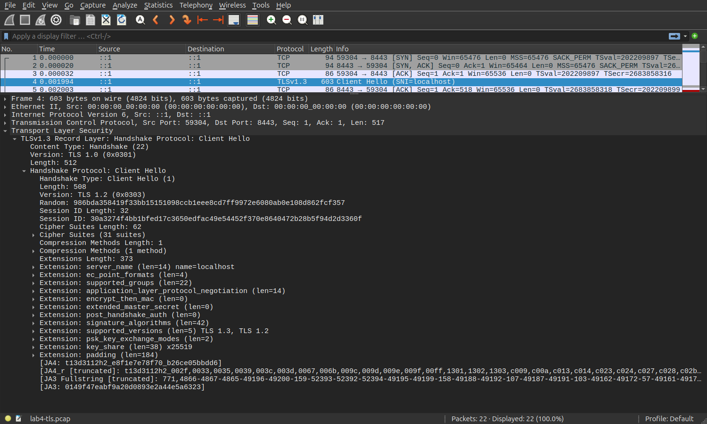
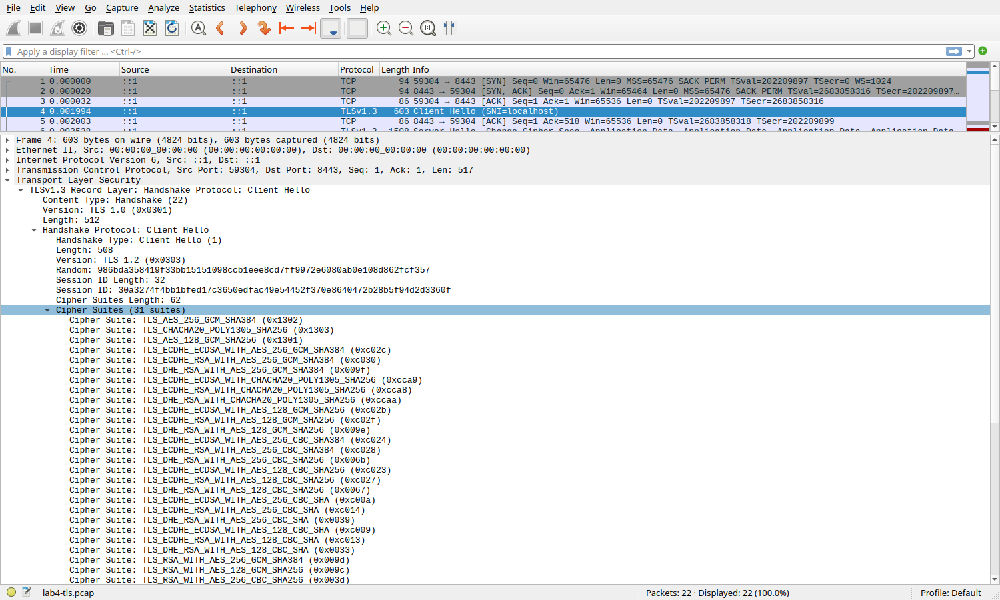
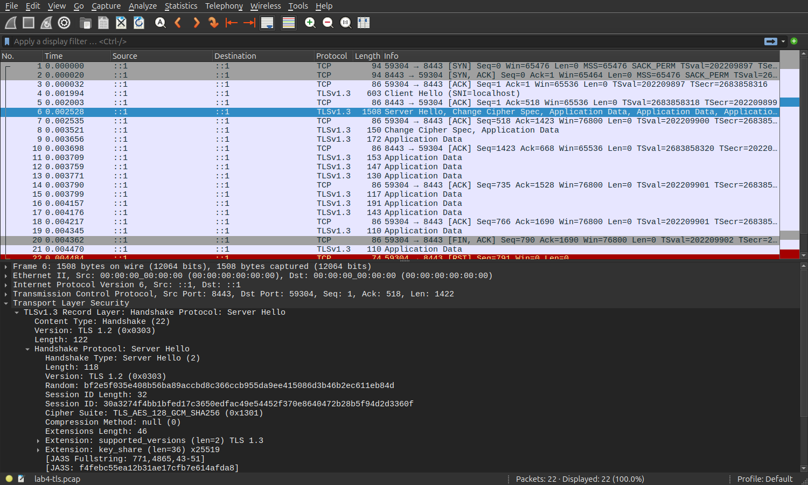

# Lab 4 — OS & Networking: Trace, Debug, and Read the Substrate

## Task 1 — Trace a Request End-to-End

### 1.1 QuickNotes request

Command:

```bash
curl -v -X POST http://localhost:8080/notes \
  -H 'Content-Type: application/json' \
  -d '{"title":"trace me","body":"in flight"}'
```

Relevant output:

```text
* Host localhost:8080 was resolved.
* IPv6: ::1
* IPv4: 127.0.0.1
*   Trying [::1]:8080...
* Connected to localhost (::1) port 8080
> POST /notes HTTP/1.1
> Content-Type: application/json
> Content-Length: 39
< HTTP/1.1 201 Created
< Content-Type: application/json
{"id":6,"title":"trace me","body":"in flight","created_at":"2026-09-24T18:03:42.820588136Z"}
```

The request used IPv6 loopback and created a note successfully.

### 1.2 Packet analysis

I captured one further POST on loopback in `lab4-trace.pcap` and decoded it into `lab4-trace.txt`. This capture created note 8; the earlier curl output in 1.1 created note 6. The capture contains ten packets spanning the full connection. The following lines are exact selections from its tcpdump decode.

#### TCP three-way handshake

```text
18:23:53.099539 IP6 ::1.38346 > ::1.8080: Flags [S], seq 1058742775, win 65476, options [mss 65476,sackOK,TS val 519296351 ecr 0,nop,wscale 10], length 0
18:23:53.099551 IP6 ::1.8080 > ::1.38346: Flags [S.], seq 2332258965, ack 1058742776, win 65464, options [mss 65476,sackOK,TS val 2761310632 ecr 519296351,nop,wscale 10], length 0
18:23:53.099561 IP6 ::1.38346 > ::1.8080: Flags [.], ack 1, win 64, options [nop,nop,TS val 519296351 ecr 2761310632], length 0
```

`[S]` is the client SYN, `[S.]` is the server SYN/ACK, and `[.]` is the client ACK completing the handshake.

#### HTTP request and JSON body

```text
18:23:53.099611 IP6 ::1.38346 > ::1.8080: Flags [P.], seq 1:175, ack 1, win 64, options [nop,nop,TS val 519296351 ecr 2761310632], length 174: HTTP: POST /notes HTTP/1.1
Host: localhost:8080
User-Agent: curl/8.5.0
Accept: */*
Content-Type: application/json
Content-Length: 39

{"title":"trace me","body":"in flight"}
```

The client sent the POST and its 39-byte JSON body in one TCP payload.

#### HTTP response and JSON body

```text
18:23:53.100065 IP6 ::1.8080 > ::1.38346: Flags [P.], seq 1:207, ack 175, win 64, options [nop,nop,TS val 2761310632 ecr 519296351], length 206: HTTP: HTTP/1.1 201 Created
Content-Type: application/json
Date: Thu, 24 Sep 2026 18:23:53 GMT
Content-Length: 93

{"id":8,"title":"trace me","body":"in flight","created_at":"2026-09-24T18:23:53.099780751Z"}
```

The server returned `201 Created` and the created note.

#### TCP connection close

```text
18:23:53.100261 IP6 ::1.38346 > ::1.8080: Flags [F.], seq 175, ack 207, win 64, options [nop,nop,TS val 519296352 ecr 2761310632], length 0
18:23:53.100344 IP6 ::1.8080 > ::1.38346: Flags [F.], seq 207, ack 176, win 64, options [nop,nop,TS val 2761310633 ecr 519296352], length 0
```

Both peers sent FIN/ACK packets to close the connection.

### 1.3 Debugging commands

#### 1. Listening socket

Command: `ss -tlnp | grep :8080`

```text
LISTEN 0      4096               *:8080             *:*    users:(("quicknotes",pid=143436,fd=3))
```

Interpretation: QuickNotes was listening on TCP port 8080.

#### 2. Routing

Command: `ip route show`

```text
default via 10.246.1.1 dev enp4s0 proto dhcp src 10.246.1.196 metric 100
default via 10.91.80.1 dev wlo1 proto dhcp src 10.91.84.20 metric 20600
10.91.80.0/20 dev wlo1 proto kernel scope link src 10.91.84.20 metric 600
10.246.1.0/24 dev enp4s0 proto kernel scope link src 10.246.1.196 metric 100
172.17.0.0/16 dev docker0 proto kernel scope link src 172.17.0.1 linkdown
172.18.0.0/30 dev tun0 proto kernel scope link src 172.18.0.1
172.19.0.0/16 dev br-731c65aa8aa4 proto kernel scope link src 172.19.0.1
172.20.0.0/16 dev br-0f962640d25b proto kernel scope link src 172.20.0.1 linkdown
172.21.0.0/16 dev br-44a07822dca6 proto kernel scope link src 172.21.0.1 linkdown
```

Interpretation: The host had default, local, container, and VPN routes. The lower metric prefers the `enp4s0` default route.

#### 3. Reachability

Command: `mtr -rwc 5 localhost`

```text
Start: 2026-09-24T21:04:44+0300
HOST: alex-Cyborg-15-A12VF Loss%   Snt   Last   Avg  Best  Wrst StDev
  1.|-- localhost             0.0%     5    0.2   0.1   0.0   0.2   0.1
```

Interpretation: Loopback was reachable with no packet loss in these five probes.

#### 4. DNS

Command: `dig +short example.com @1.1.1.1`

```text
8.6.112.0
8.47.69.0
```

Interpretation: The specified resolver answered this query with these addresses during the run.

#### 5. Logs

Command: `journalctl --user -u quicknotes -n 20 || true`

```text
-- No entries --
```

Interpretation: There were no entries for a `quicknotes` user service; this instance had been launched manually.

### 1.4 First checks for a 502

I would identify the component returning 502, usually the proxy, then check whether the QuickNotes backend is running and listening at the configured address and port. I would call `/health` directly on the backend, compare the proxy's upstream address with the actual listener, and inspect both proxy and application logs. If those checks did not explain the failure, I would examine routing, firewall rules, and DNS between the proxy and backend.

## Task 2 — Outside-In Debugging on a Broken Deploy

### 2.1 Broken deployment

Port 8080 was free before the experiment. I started two instances with the same bind address from `app/`:

```bash
GOTOOLCHAIN=go1.23.0 ADDR=:8080 go run .
GOTOOLCHAIN=go1.23.0 ADDR=:8080 go run .
```

The first instance occupied port 8080:

```text
2026/09/24 21:15:18 quicknotes listening on :8080 (notes loaded: 6)
LISTEN 0      4096               *:8080             *:*    users:(("quicknotes",pid=168884,fd=3))
```

The second instance failed with this exact output:

```text
2026/09/24 21:15:19 quicknotes listening on :8080 (notes loaded: 6)
2026/09/24 21:15:19 listen: listen tcp :8080: bind: address already in use
exit status 1
```

The attempted second deployment could not bind because the first instance already owned the port. Its initial “listening” log line was emitted before the failed `ListenAndServe` call; the bind error determines the outcome.

### 2.2 Outside-in debugging chain

#### Step 1 — Process

Command: `ps -ef | grep quicknotes`

```text
alex      168884  168722  0 21:15 ?        00:00:00 /tmp/go-build3265278485/b001/exe/quicknotes
alex      169138  168715  0 21:15 ?        00:00:00 grep quicknotes
```

Supplemental command: `ps -ef | grep -E 'quicknotes|go run' | grep -v grep`

```text
alex      168722  168715 21 21:15 ?        00:00:00 go run .
alex      168884  168722  0 21:15 ?        00:00:00 /tmp/go-build3265278485/b001/exe/quicknotes
```

Decision: The first `go run` and its compiled QuickNotes child were running; the second attempt had exited.

#### Step 2 — Listening socket

Command: `ss -tlnp | grep 8080`

```text
LISTEN 0      4096               *:8080             *:*    users:(("quicknotes",pid=168884,fd=3))
```

Decision: The first QuickNotes child, PID 168884, owned port 8080.

#### Step 3 — Host reachability

Command: `curl -s -o /dev/null -w "%{http_code}\n" http://localhost:8080/health`

```text
200
```

Decision: The existing instance was healthy and reachable locally even though the second instance failed to start.

#### Step 4 — Firewall

Command: `sudo -n iptables -L -n -v 2>/dev/null || sudo -n nft list ruleset 2>/dev/null || true`

Selected actual output:

```text
Chain INPUT (policy ACCEPT 0 packets, 0 bytes)
 pkts bytes target     prot opt in     out     source               destination

Chain FORWARD (policy DROP 0 packets, 0 bytes)
 pkts bytes target     prot opt in     out     source               destination
    0     0 DOCKER-USER  0    --  *      *       0.0.0.0/0            0.0.0.0/0
    0     0 DOCKER-FORWARD  0    --  *      *       0.0.0.0/0            0.0.0.0/0

Chain OUTPUT (policy ACCEPT 0 packets, 0 bytes)
 pkts bytes target     prot opt in     out     source               destination
```

Decision: The displayed IPv4 INPUT and OUTPUT chains had ACCEPT policies, while FORWARD had Docker chains. These findings and the successful local health request did not suggest firewall blocking of localhost:8080. The listing does not establish the full firewall policy.

#### Step 5 — DNS

Command: `dig +short localhost`

```text
127.0.0.1
```

Supplemental command: `getent hosts localhost`

```text
::1             localhost
```

Decision: `localhost` resolved locally; DNS was not the cause of the bind error.

### 2.3 Repair and re-verification

I terminated the first `go run` process (PID 168722). Its compiled child remained on port 8080, so I identified PID 168884 with `ss` and `ps`, verified that its executable was the lab QuickNotes binary under `/tmp/go-build.../exe/quicknotes`, and terminated that child as well. The port was then free.

Commands:

```bash
kill 168722
ss -tlnp | grep :8080 || true
ps -o pid,ppid,cmd -p 168884
kill 168884
ss -tlnp | grep :8080 || true
GOTOOLCHAIN=go1.23.0 ADDR=:8080 go run .
ss -tlnp | grep :8080
curl -s http://localhost:8080/health
curl -s -o /dev/null -w "%{http_code}\n" http://localhost:8080/health
```

Relevant actual output:

```text
# after terminating the go run parent
LISTEN 0      4096               *:8080             *:*    users:(("quicknotes",pid=168884,fd=3))
# identified compiled child
    PID    PPID CMD
 168884    6604 /tmp/go-build3265278485/b001/exe/quicknotes
# after terminating the compiled child: no listener
# restarted instance
LISTEN 0      4096               *:8080             *:*    users:(("quicknotes",pid=169370,fd=3))
{"notes":6,"status":"ok"}
200
```

### 2.4 Blameless mini-postmortem

The second deployment failed because port 8080 was already occupied: `listen: listen tcp :8080: bind: address already in use`. The existing instance continued serving health checks, which could conceal the failed replacement if validation only checks whether *something* responds on the port. The fixed bind address and manually coordinated process lifecycle allowed two starts to target the same socket. A deployment preflight should verify port ownership, stop or replace the previous instance in a controlled sequence, and confirm that the newly started process owns the listener. A service manager or orchestrator can make this lifecycle explicit, while startup error monitoring and deployment health checks can catch this failure promptly.

## Bonus — TLS Handshake

### B.1 HTTPS reverse proxy

QuickNotes was healthy before TLS configuration:

```bash
curl -s -o /dev/null -w '%{http_code}\n' http://localhost:8080/health
```

```text
200
```

I installed Caddy, preserved its previous default Caddyfile, and validated this lab configuration:

```text
localhost:8443 {
    reverse_proxy localhost:8080
}
```

```bash
sudo -n caddy validate --config /etc/caddy/Caddyfile
sudo -n systemctl restart caddy
ss -tlnp | grep :8443
curl -vk https://localhost:8443/health
```

Relevant actual output:

```text
Valid configuration
LISTEN 0      4096               *:8443             *:*
* SSL connection using TLSv1.3 / TLS_AES_128_GCM_SHA256 / X25519 / id-ecPublicKey
* ALPN: server accepted h2
< HTTP/2 200
< server: Caddy
{"notes":7,"status":"ok"}
```

The Caddy local certificate was not trusted by curl's normal trust store, so `-k` allowed this local test. The TLS connection and reverse proxy both worked. After collecting evidence, I restored the previous default Caddyfile and stopped the temporary service.

### B.2 TLS capture

Command sequence:

```bash
sudo -n tcpdump -i lo -nn -s 0 -w lab4-tls.pcap 'tcp port 8443'
curl -vk https://localhost:8443/health
tshark -r lab4-tls.pcap -Y 'tls.handshake.type == 1 || tls.handshake.type == 2'
```

Selected actual output:

```text
22 packets captured
    4   0.001994          ::1 → ::1          TLSv1 603 Client Hello (SNI=localhost)
    6   0.002528          ::1 → ::1          TLSv1.3 1508 Server Hello, Change Cipher Spec, Application Data, Application Data, Application Data, Application Data, Application Data
```

The full capture is in `lab4-tls.pcap`. The `TLSv1` label in the ClientHello summary reflects a legacy record field; the version negotiation fields below show the actual versions.

### B.3 ClientHello





Wireshark selected frame 4. `tshark -r lab4-tls.pcap -Y 'tls.handshake.type == 1' -V` supplied these exact decoded fields:

```text
Cipher Suites (31 suites)
    Cipher Suite: TLS_AES_256_GCM_SHA384 (0x1302)
    Cipher Suite: TLS_CHACHA20_POLY1305_SHA256 (0x1303)
    Cipher Suite: TLS_AES_128_GCM_SHA256 (0x1301)
    Cipher Suite: TLS_ECDHE_ECDSA_WITH_AES_256_GCM_SHA384 (0xc02c)
    Cipher Suite: TLS_ECDHE_RSA_WITH_AES_256_GCM_SHA384 (0xc030)
    Cipher Suite: TLS_DHE_RSA_WITH_AES_256_GCM_SHA384 (0x009f)
Extension: server_name (len=14) name=localhost
Extension: supported_versions (len=5) TLS 1.3, TLS 1.2
    Supported Version: TLS 1.3 (0x0304)
    Supported Version: TLS 1.2 (0x0303)
```

These are the first six of the 31 offered cipher suites; the packet contains the complete list. The SNI was `localhost`. The client offered TLS 1.3 and 1.2 in `supported_versions`.

### B.4 ServerHello



Wireshark selected frame 6. The decoded ServerHello contained:

```text
Cipher Suite: TLS_AES_128_GCM_SHA256 (0x1301)
Extension: supported_versions (len=2) TLS 1.3
    Supported Version: TLS 1.3 (0x0304)
```

The server selected TLS 1.3 and `TLS_AES_128_GCM_SHA256`. The ServerHello's legacy `Version: TLS 1.2 (0x0303)` field is a compatibility value; the `supported_versions` extension is the negotiated version.

### B.5 Certificate chain

Command: `openssl s_client -connect localhost:8443 -servername localhost -showcerts </dev/null`

Selected actual output:

```text
Certificate chain
 0 s:
   i:CN = Caddy Local Authority - ECC Intermediate
   a:PKEY: id-ecPublicKey, 256 (bit); sigalg: ecdsa-with-SHA256
   v:NotBefore: Sep 24 18:21:31 2026 GMT; NotAfter: Sep 25 06:21:31 2026 GMT
 1 s:CN = Caddy Local Authority - ECC Intermediate
   i:CN = Caddy Local Authority - 2026 ECC Root
   a:PKEY: id-ecPublicKey, 256 (bit); sigalg: ecdsa-with-SHA256
New, TLSv1.3, Cipher is TLS_AES_128_GCM_SHA256
Verification error: unable to get local issuer certificate
Verify return code: 20 (unable to get local issuer certificate)
```

Caddy sent the localhost leaf and its local intermediate. The root was not trusted by OpenSSL in this run, which explains verification code 20.

### B.6 TLS 1.0 / 1.1 negotiation

Protocol version negotiation occurs between ClientHello and ServerHello. In this capture, the client's `supported_versions` extension offered TLS 1.3 and 1.2, not TLS 1.0 or 1.1. The server's `supported_versions` extension selected TLS 1.3. Therefore the observed connection could not negotiate TLS 1.0 or 1.1. The lower legacy record and Hello version fields do not override that extension.

