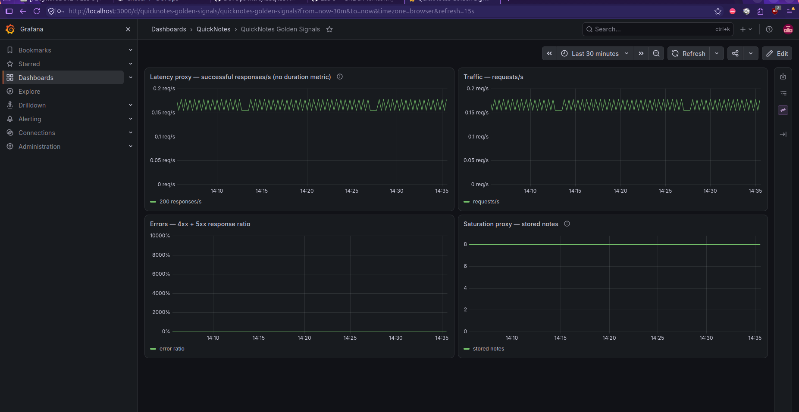
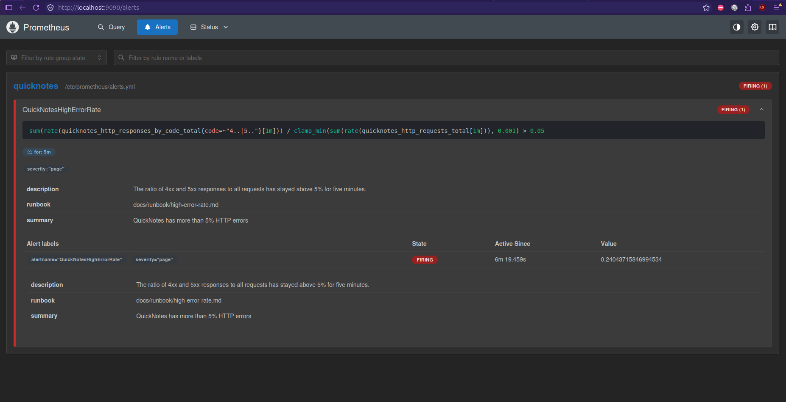

# Lab 8 — SRE and Monitoring

## Environment

| Component | Observed version |
|---|---|
| Docker | 29.8.1 |
| Docker Compose | v5.5.1 |
| Prometheus image | `prom/prometheus:v3.7.3` |
| Grafana image | `grafana/grafana:13.2.2` |

The local stack is defined in [compose.yaml](../compose.yaml). Grafana credentials are stored only in a local `.env.lab8` file, which is excluded from this repository locally.

## Task 1 — Prometheus and Grafana

### Prometheus configuration

[Prometheus configuration](../monitoring/prometheus/prometheus.yml) scrapes `quicknotes:8080/metrics` every 15 seconds across the Compose network. The Prometheus targets API reported `job=quicknotes`, `scrapeUrl=http://quicknotes:8080/metrics`, `health=up`, and an empty `lastError`.

### Grafana provisioning

The [datasource](../monitoring/grafana/provisioning/datasources/datasource.yml) uses `http://prometheus:9090` with UID `prometheus` and is the default source. The [dashboard provider](../monitoring/grafana/provisioning/dashboards/dashboard.yml) loads the [Golden Signals dashboard](../monitoring/grafana/dashboards/golden-signals.json) from its mounted JSON directory. Grafana's API returned the datasource and dashboard after the stack started; no manual creation was needed.

### Golden Signals queries

The exact metric names and the `code` label below were observed at QuickNotes' `/metrics` endpoint. QuickNotes has no request-duration histogram or summary, so its application metrics cannot supply true latency percentiles.

| Panel | PromQL | Interpretation |
|---|---|---|
| Latency proxy | `rate(quicknotes_http_responses_by_code_total{code="200"}[1m])` | Successful responses per second; this is a throughput and availability proxy, **not measured latency**. |
| Traffic | `rate(quicknotes_http_requests_total[1m])` | Average requests per second. |
| Errors | `sum(rate(quicknotes_http_responses_by_code_total{code=~"4..|5.."}[1m])) / clamp_min(sum(rate(quicknotes_http_requests_total[1m])), 0.001)` | Ratio of 4xx and 5xx responses to all requests. |
| Saturation proxy | `quicknotes_notes_total` | Current stored note count, a proxy for data-store utilization rather than host capacity. |

The [mixed-traffic script](../monitoring/scripts/generate-traffic.sh) sent 200 requests: 180 returned 200, four returned 201, and 16 returned 400. Prometheus range queries returned samples for all four panels. The maximum observed rates over that five-minute query were 3.56 successful responses/s and 3.93 requests/s; the maximum error ratio was 0.0778, and the stored note count was eight.

### Design questions

**a) Pull versus push.** Prometheus initiates HTTP scrapes, so it must reach `quicknotes:8080` through the Compose network. QuickNotes does not push its measurements to Prometheus. If network access fails, the target becomes DOWN, new samples stop, and queries eventually become stale or empty.

**b) Scrape interval.** This deployment uses 15 seconds. A five-second interval gives denser samples, but increases scrape, storage, network, CPU, and query cost and can make short-term graphs noisier. A five-minute interval misses short incidents, makes rates coarse, and can delay alerts substantially.

**c) `rate`, `irate`, and `delta`.** The request count is a monotonically increasing counter, so `rate()` gives a stable average per-second traffic rate over a window. `irate()` uses only the latest two points and fluctuates more; it is useful when inspecting very short spikes. `delta()` measures absolute change across a range and is intended for gauges rather than the request-counter rate used here.

**d) File provisioning.** Datasource and dashboard definitions are version controlled, reviewable, reproducible, and automatically restored with a fresh Grafana instance. No setup depends on remembering manual UI steps.

## Task 2 — High Error Rate Alert

### Rule and runbook

The [Prometheus rule](../monitoring/prometheus/alerts.yml) defines one `QuickNotesHighErrorRate` alert. It pages when the measured 4xx plus 5xx response ratio is greater than 5% for five continuous minutes. Its `severity` is `page`, and its annotation links to the [runbook](../docs/runbook/high-error-rate.md). `promtool check config` validated the configuration and reported one rule.

### Trigger, Firing evidence, and recovery

A single malformed `POST /notes` returned HTTP 400 and did not immediately activate the alert. The sustained generator then started at **2026-09-25T11:41:14Z** and issued one malformed POST alongside three successful requests per cycle. The rule entered Pending at **2026-09-25T11:42:12Z** according to its `activeAt` timestamp, observed by the API at 11:42:20Z. The API first showed Firing at **2026-09-25T11:47:21Z**, with an error ratio of **0.2404** (about 24%). The temporary generator was stopped at **2026-09-25T11:50:13Z**; the API showed no active alerts at **2026-09-25T11:51:17Z**, and the rule state was inactive with health `ok`. QuickNotes again returned HTTP 200 from `/health`, and the Prometheus target remained UP.

### Design questions

**e) Five-minute condition.** A single failed request should not page the on-call. Requiring five minutes above the threshold filters brief client mistakes and transient spikes while keeping sustained user-visible degradation actionable.

**f) Symptom versus cause.** The high HTTP error ratio measures a symptom users experience. High CPU, disk pressure, or container restarts can be possible causes, but paging solely on one of those may produce alerts while requests still succeed. The symptom page tells the on-call to investigate actual failed requests and then find the cause.

**g) Alert fatigue.** An operational review threshold is: if more than 20% of pages in a month have no measurable user impact, investigate and tune the alert. This is a team decision threshold, not a universal rule.

## Bonus — External Synthetic Monitoring

### Public endpoint and synthetic check

An ngrok HTTPS tunnel published the local health-only proxy at `https://mango-banked-cherisher.ngrok-free.dev/health`. The tunnel forwarded to `127.0.0.1:18181`, where [the proxy](../monitoring/scripts/health-proxy.py) accepted only `GET /health` and forwarded that request to QuickNotes. Public `GET /health` returned HTTP 200; public `GET /notes` and `GET /metrics` returned HTTP 404, and `POST /notes` returned HTTP 405. The tunnel did not expose QuickNotes port 8080 directly.

Checkly API check `16d6af48-20ff-496e-87dc-24745197fe5e` requested that HTTPS URL every minute, in parallel from Frankfurt (`eu-central-1`) and Singapore (`ap-southeast-1`). It required status code 200 and response time below 2,000 ms (`maxResponseTime=2000` and a response-time assertion). TLS verification remained enabled. The check was active during the observation and its alerts were muted to avoid test notifications.

### Matching 31-minute observation

The common measurement window was **2026-09-25T13:00:00Z to 2026-09-25T13:31:00Z**, a real **31 minutes**. The first Checkly result inside it started at 13:00:36.781Z and the last at 13:30:37.174Z. Checkly's final-result API returned 62 results: 31 from each region, all successful and none with an error or failed assertion. Its analytics API, queried with those exact bounds and a 60-minute aggregation interval, returned the following response-time percentiles and 100% availability.

| Checkly location | Final results | Successful | Response time p50 | Response time p95 |
|---|---:|---:|---:|---:|
| Frankfurt (`eu-central-1`) | 31 | 31 | 108 ms | 140 ms |
| Singapore (`ap-southeast-1`) | 31 | 31 | 417 ms | 447 ms |
| Both regions combined | 62 | 62 | 146 ms | 437 ms |

Prometheus was queried at the same end timestamp with `sum(increase(quicknotes_http_responses_by_code_total{code=~"4..|5.."}[1860s]))`; it returned **0** application HTTP 4xx/5xx responses. The QuickNotes target was `up=1`. QuickNotes exposes request and response counters but no request-duration histogram or summary, so Prometheus cannot calculate real request-latency p50 or p95 from this metric model.

| | Prometheus (inside the Compose net) | Checkly (from 2 regions) |
|---|---:|---:|
| Avg latency p50 | Unavailable: no duration metric | 146 ms |
| Avg latency p95 | Unavailable: no duration metric | 437 ms |
| Errors observed | 0 HTTP 4xx/5xx responses | 0 failed checks out of 62 |

Checkly measured the public path, including DNS resolution, TLS, the ngrok tunnel, and regional network latency; the Singapore p50 of 417 ms exceeded Frankfurt's 108 ms in this window. Prometheus measured QuickNotes internally and still reported the target UP and zero HTTP errors. An external check can catch public DNS, routing, TLS, or tunnel failures even while the internal scrape succeeds. Conversely, Prometheus exposes application counters and alert state that an external health request cannot inspect. A temporary DNS timeout from this workstation did not appear in Checkly's two-region results, which is why the comparison uses the recorded regional checks rather than that local probe.
